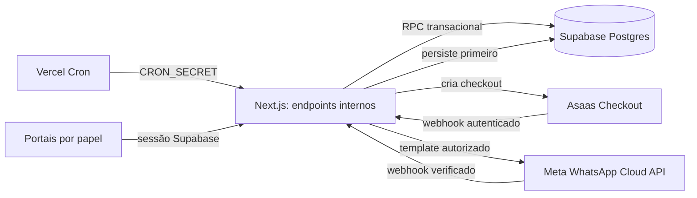

# FLERNK — Contrato técnico e integrações do MVP

Data: 07/09/2026. Estado: contrato documental concluído; implementação reservada às Tasks 05–23.

Este documento transforma as regras das Tasks 01–03 em um contrato implementável. Não cria schema, credenciais, cobranças, mensagens ou alterações em Supabase/Vercel. Nomes finais de tabelas e campos serão consolidados nas migrations da Task 06, preservando os invariantes definidos aqui.

## 1. Decisões de arquitetura

1. A aplicação atende somente a FLERNK na experiência do produto. Não haverá cadastro público, seletor ou provisionamento autônomo de outras assessorias. O banco preserva `assessoria_id` nas entidades de negócio para ownership, defesa em profundidade e migração segura dos registros existentes.
2. O motor interno da aplicação é a única fonte de geração dos ciclos e cobranças recorrentes. O provedor nunca mantém uma assinatura recorrente paralela. Reexecução do motor para a mesma assinatura e competência reutiliza a cobrança existente.
3. O provedor escolhido para o MVP é o **Asaas Checkout hospedado**, com Pix e cartão e recebimento direto na conta FLERNK, sem split. A aplicação não recebe nem armazena número de cartão, CVV ou payload bruto do cartão. Conta, Sandbox, credenciais, tarifas e condições comerciais são gates externos das Tasks 19–20.
4. A comunicação escolhida é a **Meta WhatsApp Cloud API**, por templates, para lembretes transacionais. Não haverá bot conversacional ou IA no MVP. Conta, número, token, opt-in e templates aprovados são gates externos das Tasks 22–23.
5. O scheduler primário é o **Vercel Cron**, em UTC, chamando endpoints internos autenticados do Next.js. O Supabase Postgres guarda a fonte de verdade, locks, filas e eventos duráveis. Supabase Cron é fallback operacional, ativado somente por decisão registrada; os dois schedulers nunca executam a mesma agenda ao mesmo tempo. Compatibilidade e frequência do plano Vercel são gates das Tasks 05 e 31.
6. O retorno do checkout no navegador apenas leva o aluno de volta ao portal com estado `aguardando_confirmacao`. Somente webhook autenticado/processado ou baixa manual auditável confirma pagamento.
7. O professor não consulta tabelas, views ou RPCs financeiras. Um contrato próprio entrega apenas `em_dia`, `pendente`, `nao_configurado` ou `indisponivel`, sem valores, vencimentos, identificadores de cobrança/pagamento ou ações financeiras.

O Asaas documenta checkout hospedado com Pix e cartão e orienta usar webhooks para acompanhar seu resultado; ambientes Sandbox e produção são separados. A decisão usa essas capacidades, sem afirmar que uma conta real já existe ([visão geral](https://docs.asaas.com/docs/visao-geral), [checkout](https://docs.asaas.com/docs/asaas-checkout), consulta em 07/09/2026). O Vercel Cron aciona rotas de produção por `GET` e usa UTC ([Vercel Cron Jobs](https://vercel.com/docs/cron-jobs), consulta em 07/09/2026). Supabase Cron/`pg_cron` pode executar SQL ou chamadas HTTP e fica documentado apenas como fallback ([Supabase Cron](https://supabase.com/docs/guides/cron), [agendamento de funções](https://supabase.com/docs/guides/functions/schedule-functions), consulta em 07/09/2026).

## 2. Limites dos componentes

- Next.js valida sessão, payload, papel e ownership, adapta provedores e expõe respostas mínimas.
- RPCs transacionais aplicam unicidade, locks, transições e auditoria. Operações privilegiadas vivem em schema privado e não são chamadas diretamente pelo cliente.
- Postgres é a autoridade sobre aluno, matrícula, assinatura, cobrança, pagamento, fila e estado processado de eventos.
- Asaas é autoridade sobre o evento externo que confirma ou reverte um pagamento, mas não gera ciclos recorrentes internos.
- Meta é autoridade sobre aceitação/entrega de mensagens; não decide elegibilidade financeira.
- Jobs podem ser repetidos. Toda mutação precisa permanecer correta sob repetição, concorrência e chegada fora de ordem.

## 3. Modelo de dados alvo

Todas as entidades de negócio têm UUID interno, `assessoria_id`, `created_at` e `updated_at`, salvo eventos append-only. FKs de ownership devem impedir vínculo cruzado entre assessorias. Índices devem cobrir FKs, filtros de RLS, estados e agendas de workers; índices parciais são preferíveis para filas pendentes. Listas operacionais usam paginação por cursor estável quando puderem crescer.

| Domínio | Entidades e relações mínimas | Integridade e histórico |
| --- | --- | --- |
| Identidade | `team_members` associa perfil autenticado à FLERNK e papel `socio`/`professor`; `students` é cadastro administrativo e aceita `auth_user_id` nulo/único | Conta de aluno é vinculada depois, sem usar `students.id = auth.users.id`; impedir remoção do último sócio ativo |
| Matrícula | `enrollments` liga aluno à FLERNK; `enrollment_history` registra transições, ator, motivo e instante | Uma matrícula operacional não muda por atraso; histórico append-only |
| Turmas | `classes`, `class_memberships`, `class_meetings`, `attendances`, `absence_justifications` | Unicidade por turma+ocorrência e encontro+aluno; encontro cancelado não aceita presença e não entra no denominador |
| Planos | `plans` identifica oferta; `plan_versions` congela preço, moeda, periodicidade e regras | Assinatura referencia versão/snapshot; editar plano não reescreve passado |
| Assinaturas | `subscriptions` liga aluno, matrícula e versão de plano; `subscription_history` registra condição e transição | Ciclo, dia de vencimento, vigência e renovação separados da matrícula e do pagamento |
| Cobrança | `billing_cycles` representa competência; `charges` representa obrigação; `charge_adjustments` registra desconto/cancelamento/ajuste | `unique(subscription_id, cycle_key)`; valor e vencimento ficam congelados; nenhuma exclusão destrutiva |
| Checkout | `payment_checkouts` liga cobrança a sessão externa | `unique(provider, provider_checkout_id)` e no máximo um checkout ativo reutilizável por cobrança/método; expiração não quita |
| Pagamento | `payments` registra recebimento confirmado; `payment_reversals` registra estorno/chargeback | `unique(provider, external_payment_id)`; baixa manual tem chave idempotente, autor e motivo; reversão não apaga pagamento |
| Caixa | `expenses`, `other_revenues`, `cash_movements` e categorias | Valores previstos e realizados separados; movimentos originados por cobrança/receita não se duplicam |
| Integrações | `provider_events` persiste envelope mínimo; `integration_attempts` registra chamadas sanitizadas | `unique(provider, external_event_id)`; payload bruto sensível não vai para logs e retenção é definida na Task 20 |
| Comunicação | `contact_preferences`, `message_jobs`, `message_events`, `message_templates` | `unique(charge_id, cadence_offset, template_version)`; opt-in/opt-out e versão do template ficam rastreáveis |
| Captação | `leads`, `lead_history` | Chave de deduplicação normalizada; conversão referencia o lead e não cria conta/cobrança implicitamente |
| Auditoria | `audit_entries` com ator, papel, ação, alvo, antes/depois permitido, motivo, correlação e instante | Append-only; sem segredo ou PII desnecessária; toda baixa/correção/replay privilegiado é auditado |

### Tipos e datas

- Dinheiro: inteiro em centavos, não negativo conforme o tipo, `currency = 'BRL'`; cálculos intermediários e taxas também usam centavos. Nunca usar ponto flutuante.
- Competência: `cycle_key` civil estável, preferencialmente a primeira data do ciclo; não confundir competência, vencimento, autorização e liquidação.
- Datas civis de vencimento: tipo `date`, calculadas em `America/Sao_Paulo`. Instantes de evento, auditoria e processamento: `timestamptz`, persistidos em UTC.
- Primeiro vencimento: próxima data configurada igual ou posterior ao início. Dia inexistente usa o último dia do mês.
- IDs externos permanecem texto opaco. O `externalReference` enviado ao Asaas é o UUID estável da cobrança interna e nunca contém nome, telefone ou e-mail.
- Snapshot contratual preserva valor, periodicidade, dia de vencimento e versão aplicados ao ciclo. Ajustes posteriores criam registros, sem mutar o fato original de modo invisível.

### Relação com o legado

`assinaturas_atletas`, `cobrancas`, `eventos_financeiros`, `preferencias_comunicacao` e `lembretes_cobranca` são material para adaptação, não fundação aprovada. Faltam pagamentos, checkouts e eventos de provedor; políticas genéricas `is_treinador` excedem o acesso do professor. Os serviços atuais gravam assinatura+cobrança+auditoria e baixa+auditoria em operações separadas, portanto podem deixar estado parcial. Tasks 06 e 14–23 devem migrar ou substituir essas rotas com RPCs atômicas, novas RLS e chaves idempotentes, sem apagar dados existentes.

## 4. Máquinas de estado e invariantes

| Agregado | Estados | Transições permitidas e regras |
| --- | --- | --- |
| Matrícula | `active`, `suspended`, `ended` | `active ↔ suspended`; ambos podem ir a `ended`; reativação de encerrada cria novo vínculo/histórico conforme Task 11. Pagamento nunca muda matrícula automaticamente |
| Assinatura | `draft`, `active`, `paused`, `ended`, `canceled`, `exempt` | `draft → active/exempt/canceled`; `active ↔ paused`; `active/paused → ended/canceled`. Pausa impede ciclos cuja elegibilidade começa na data efetiva; cobrança emitida permanece |
| Cobrança | `draft`, `open`, `overdue`, `paid`, `reversed`, `canceled`, `exempt` | `draft → open/canceled/exempt`; `open ↔ overdue` por data; `open/overdue → paid/canceled/exempt`; `paid → reversed` somente por reversão confirmada; `reversed → paid` somente por novo pagamento confirmado. Cada mudança aponta para o fato causador |
| Checkout | `created`, `active`, `paid`, `expired`, `canceled`, `failed` | `created → active/failed`; `active → paid/expired/canceled/failed`. Estado terminal não retrocede; novo checkout recebe novo registro |
| Pagamento | `pending`, `confirmed`, `failed` | `pending → confirmed/failed`; confirmação é única por ID externo. Estorno e chargeback ficam em `payment_reversals` com `requested/confirmed/failed`, sem excluir o pagamento |
| Despesa | `planned`, `paid`, `canceled` | `planned → paid/canceled`; correção de pagamento é movimento compensatório auditado, não remoção silenciosa |
| Evento externo | `received`, `processing`, `processed`, `retryable_failure`, `dead_letter`, `ignored` | Persistir antes de 2xx; claim atômico; falha transitória volta à fila com limite; evento válido mas irrelevante/antigo vira `ignored` com motivo |
| Mensagem | `queued`, `claimed`, `submitted`, `delivered`, `read`, `retryable_failure`, `canceled`, `dead_letter` | Claim atômico; revalidação pode cancelar; confirmações externas avançam monotonicamente; `read` não retrocede para `delivered` |
| Lead | `new`, `contacted`, `trial_scheduled`, `converted`, `closed` | Transições administrativas auditadas; conversão é idempotente e não cria assinatura/cobrança |

Invariantes transversais:

- matrícula, assinatura, cobrança, checkout e pagamento são fatos distintos;
- no máximo uma cobrança por assinatura+ciclo, inclusive sob dois crons concorrentes;
- no máximo um pagamento confirmado por identificador externo; repetição não cria caixa duplicado;
- evento fora de ordem nunca reabre estado terminal nem desfaz confirmação válida;
- a ordem financeira usa o instante efetivo e o identificador do fato externo, não a ordem de chegada; evento antigo processado depois não vence pagamento/reversão mais recente;
- cancelamento/isenção exigem motivo e ator; quitação confirmada cancela lembretes ainda não submetidos;
- baixa manual exige sócio, valor, data, meio, motivo e `Idempotency-Key`; sua transação confirma pagamento, atualiza cobrança, cria movimento e auditoria ou não grava nada;
- workers usam claim transacional (`FOR UPDATE SKIP LOCKED` ou equivalente), lease com expiração e contador de tentativas;
- funções que alteram vários agregados usam RPC/transação no banco; falha não deixa auditoria ou movimento órfão.

## 5. Contrato HTTP e RPC

As APIs são internas ao produto, versionadas em `/api/v1` quando consumidas pelos portais. Payloads são validados por allowlist e têm limite de tamanho. Sucesso usa `{ "data": ... }`; erro usa `{ "error": { "code": "...", "message": "...", "details": [...] }, "request_id": "..." }`. Erros externos e SQL não são expostos. Usar `400/422` para entrada inválida, `401` sem sessão/token, `403` sem papel, `404` para recurso inexistente ou alheio, `409` para conflito de estado/idempotência, `429` para limite, `502/503` para dependência indisponível.

| Operação | Contrato e autenticação | Idempotência, ownership e limites |
| --- | --- | --- |
| `GET /api/internal/cron/billing/generate` | `Authorization: Bearer $CRON_SECRET`; produção Vercel; rejeita segredo ausente/inválido | Gera janela limitada por RPC; `unique(subscription_id, cycle_key)`; lock/advisory lock evita sobreposição; resposta traz contagens, sem PII |
| `POST /api/v1/charges/{chargeId}/checkout` | Sessão Supabase do aluno; CSRF/origin conforme estratégia da Task 09; valida cobrança pertencente ao aluno autenticado | Requer `Idempotency-Key`; reutiliza checkout ativo; rate limit por usuário/cobrança/IP; só cria no Asaas após reserva interna |
| `POST /api/v1/payments/manual` | Sessão de sócio e reautenticação quando definida; professor/aluno negados | Chave idempotente, transação única, estado esperado, motivo obrigatório e auditoria |
| `POST /api/v1/webhooks/asaas` | Público por necessidade; valida `asaas-access-token` contra segredo de webhook separado, em comparação segura; HTTPS, método, tipo e tamanho | Persiste `provider+event_id` antes de responder 2xx; duplicado retorna 2xx; processamento assíncrono; rate limit não pode descartar eventos legítimos |
| `POST /api/internal/provider-events/process` | Cron/worker autenticado internamente | Claim com lease; processador reentrante valida `externalReference`, IDs e valor/moeda; transação monotônica |
| `GET /api/internal/cron/billing/reconcile` | Cron autenticado; somente ambiente correto | Seleciona eventos/checkouts pendentes ou antigos em lote limitado; chamadas ao provedor com timeout/backoff; não inventa quitação |
| `GET /api/v1/professor/students/{studentId}/financial-status` | Sessão `professor`/`socio`, aluno da mesma FLERNK e vínculo operacional autorizado | Retorna exclusivamente `{ data: { status: enum } }`; erro/dependência indisponível retorna `indisponivel`; sem IDs/valores/datas |
| `GET /api/internal/cron/messages/enqueue` | Cron autenticado | Enfileira D-5, D-1 e D+3 configuráveis; chave cobrança+cadência+versão impede duplicação |
| `POST /api/internal/message-jobs/process` | Worker autenticado | Claim com lease; revalida cobrança, matrícula e preferência imediatamente antes da chamada Meta; tentativas exponenciais limitadas |
| `GET /api/v1/webhooks/meta` | Challenge do webhook conforme contrato Meta, com verify token secreto | Responde challenge apenas quando token e parâmetros forem válidos; sem sessão de usuário |
| `POST /api/v1/webhooks/meta` | Verifica assinatura da requisição com segredo do app antes de interpretar o corpo | Persiste evento único, responde rápido e atualiza entrega monotonicamente em processamento assíncrono |

Os nomes são contrato de direção e podem mudar na Task de implementação somente por ADR equivalente e atualização desta rastreabilidade. Webhooks devem tolerar campos novos, rejeitar tipos essenciais inválidos e armazenar apenas o necessário. Segundo a documentação do Asaas, a entrega de webhooks é pelo menos uma vez; o consumidor deve deduplicar pelo ID do evento, persistir antes do processamento e responder rapidamente ([idempotência](https://docs.asaas.com/docs/como-implementar-idempotencia-em-webhooks), [autenticação e recebimento](https://docs.asaas.com/docs/receba-eventos-do-asaas-no-seu-endpoint-de-webhook), consulta em 07/09/2026).

### Derivação do indicador do professor

A projeção é calculada no servidor/banco e aplica esta precedência: falha ao consultar os dados necessários resulta em `indisponivel`; ausência de assinatura/configuração financeira elegível resulta em `nao_configurado`; qualquer cobrança vencida, não cancelada, não isenta e sem recebimento líquido suficiente — inclusive após reversão confirmada — resulta em `pendente`; caso contrário, resulta em `em_dia`. Cobrança futura aberta não torna o aluno pendente antes do vencimento. O contrato não retorna a causa, o valor ou a data ao professor e não usa o indicador para suspender matrícula ou presença.

### Processos ponta a ponta

**Geração recorrente.** O cron solicita uma janela civil. A RPC seleciona assinaturas elegíveis, calcula competência/vencimento em `America/Sao_Paulo`, congela o snapshot, insere por chave única e registra auditoria. Repetição retorna a mesma cobrança. Pausa/cancelamento interrompe somente ciclos futuros conforme data efetiva.

**Checkout.** O servidor valida sessão, ownership e cobrança `open/overdue`, reserva uma tentativa e chama o Asaas com `externalReference = charge.id`. Se a chamada conclui, grava ID/URL/expiração. Se a resposta se perde, a reserva fica reconciliável e a mesma chave não cria uma sequência descontrolada de checkouts. Retorno do navegador consulta o estado local e mostra espera até webhook.

**Webhook financeiro.** O handler autentica, valida envelope mínimo e insere evento por chave única. Após persistência responde 2xx. Worker trava o evento e a cobrança, compara provedor, referência, valor e moeda e aplica transição monotônica numa transação. Apenas o evento de pagamento confirmado aplicável — correlacionado ao checkout quando necessário — cria pagamento e movimento uma vez; um estado de checkout sozinho não substitui essa validação. Expiração/cancelamento/falha não quita. Estorno/chargeback confirmado cria reversão, altera a projeção da cobrança e do caixa e mantém o pagamento original.

**Reconciliação.** Job periódico revisa evento em falha, checkout pendente acima do limite e pagamento divergente. Consulta Asaas por ID estável dentro da janela operacional, persiste o resultado como evento/fato e reutiliza o mesmo processador. A operação é paginada, limitada e observável. O Asaas informa retenção limitada de eventos no mecanismo de webhooks; a Task 20 definirá frequência e runbook dentro da capacidade real da conta.

**Lembretes.** O enfileirador identifica cobranças elegíveis para D-5, D-1 e D+3. O worker trava um job, revalida cobrança não paga/não cancelada, matrícula elegível, opt-in e template aprovado, então chama a Meta com chave interna e registra ID externo. Quitação antes da submissão cancela o job. Se o provedor já aceitou a mensagem, o fato permanece rastreado mesmo que o pagamento chegue logo depois. Webhook de status só avança `submitted → delivered → read`; falha terminal vai para operação manual. A disponibilidade da conta, número e templates na Meta WhatsApp Cloud API será revalidada oficialmente na Task 22 ([documentação oficial](https://developers.facebook.com/docs/whatsapp/cloud-api/overview), consulta tentada em 07/09/2026; disponibilidade externa ainda não comprovada).

## 6. Autorização, RLS e segredos

| Papel/processo | Permissão de dados |
| --- | --- |
| Sócio | CRUD administrativo/financeiro da FLERNK conforme regra de negócio; integrações, baixa e replay auditados |
| Professor | Operação de alunos/turmas/frequência/interessados da FLERNK; somente enum agregado financeiro por função não financeira |
| Aluno | Perfil, matrícula, agenda, frequência e cobranças próprias; checkout apenas da própria cobrança |
| Público | Criar interesse protegido e receber webhooks autenticados; nunca criar organização, equipe, matrícula, assinatura ou cobrança |
| Serviço | Apenas endpoints internos e RPCs específicas; chave privilegiada nunca chega ao navegador |

- Habilitar RLS em toda tabela exposta. Políticas verificam `assessoria_id`, papel ativo e ownership do aluno; adicionar índices nas colunas usadas por RLS.
- Professor não recebe `SELECT` em cobrança, checkout, pagamento, evento, despesa, movimento ou auditoria financeira. A função do indicador retorna enum, roda em schema privado, fixa `search_path`, qualifica objetos, valida a FLERNK/papel e não aceita `assessoria_id` arbitrário do cliente.
- Funções `security definer` são exceção: owner não exposto, `search_path` fixo, `EXECUTE` revogado de `public`, `anon` e `authenticated` por padrão e concedido apenas ao chamador necessário. RPC não confia em papel, aluno ou organização enviados pelo cliente.
- Segredos separados por ambiente: chave Asaas, token de webhook Asaas, credenciais Meta, app secret/verify token, `CRON_SECRET` e service role. Nenhum usa prefixo `NEXT_PUBLIC`; preview usa Sandbox e números de teste ou fica bloqueado.
- Tokens de webhook diferem das chaves de API. Rotação mantém janela curta documentada. Segredos não entram em repositório, banco de domínio, URL, resposta ou log.
- Cookies de sessão permanecem `HttpOnly`, `Secure` e `SameSite` adequados; mutações validam origem/CSRF. CORS é restrito aos hosts necessários.
- Logs guardam IDs internos, código do evento, tentativa, latência e correlação. Redigir nome, telefone, e-mail, token, payload de cartão, URL de checkout sensível e corpo integral de webhook.

## 7. Matriz de falhas e recuperação

| Falha | Comportamento seguro | Recuperação/evidência |
| --- | --- | --- |
| Timeout/indisponibilidade Asaas ao criar checkout | Não marcar pago; preservar reserva como desconhecida/reconciliável; não repetir sem mesma chave | Reconciliar por referência/ID; alerta por taxa de erro |
| Falha local depois da chamada externa | Não criar nova sessão cegamente | Registrar tentativa/correlação antes da chamada; reconciliação completa o vínculo |
| Webhook duplicado | Retornar 2xx sem duplicar efeito | Unicidade do evento e do pagamento; métrica de duplicados |
| Eventos fora de ordem | Não retroceder estado terminal | Regras monotônicas e evento `ignored` com motivo; reconciliar divergência |
| Retorno do navegador sem webhook | Mostrar aguardando confirmação | Poll limitado do estado local e job de reconciliação; nunca baixa pelo redirect |
| Evento perdido | Estado continua pendente, sem falso positivo | Reconciliação consulta provedor; alerta por idade de pendência |
| Cron executado duas vezes | Uma cobrança/job por chave natural | Constraint única, transação e contagem `created/reused/conflict` |
| Dois workers no mesmo item | Um claim válido; outro ignora | Lock/lease e `SKIP LOCKED`; lease vencida permite retomada |
| Token/assinatura inválido | Rejeitar antes de persistir efeito | `401/403`, log sanitizado e alerta por volume; nenhum dado de domínio muda |
| Payload válido com campos futuros | Processar envelope conhecido | Parser tolerante a desconhecidos; payload essencial inválido vai para falha observável |
| Opt-out antes do envio | Cancelar job | Revalidação imediatamente antes de chamar Meta e motivo auditado |
| Quitação após enqueue | Cancelar se ainda não submetido | Lock/revalidação; se já submetido, conservar status e não repetir |
| Meta aceita e resposta local se perde | Não enviar de novo imediatamente | Estado desconhecido/reconciliável, ID/correlação quando disponível, retry limitado |
| Retry esgotado | Não loopar indefinidamente | `dead_letter`, alerta, ação de replay exclusiva de sócio e auditada |
| Baixa manual concorrente com webhook | Uma confirmação e um movimento | Lock da cobrança, chave externa/manual e conflito idempotente |
| Banco indisponível no webhook | Não confirmar efeito nem descartar silenciosamente | Retornar erro para retry do provedor; alerta; só responder 2xx após persistência |

## 8. Observabilidade e operação

- Propagar `request_id`/`correlation_id` entre cron, chamada externa, evento, cobrança, job e auditoria.
- Registrar `attempt_count`, `next_attempt_at`, `claimed_at`, `lease_until`, `processed_at`, erro categorizado e resposta externa sanitizada.
- Métricas mínimas: cobranças criadas/reutilizadas/conflitantes; idade de checkout pendente; eventos recebidos/duplicados/falhos/dead-letter; pagamentos confirmados/revertidos; mensagens enfileiradas/submetidas/entregues/falhas/canceladas; duração e atraso dos crons.
- Alertas: cron sem execução, crescimento de fila, lease expirada repetida, falha de autenticação anormal, evento financeiro morto, divergência de valor/moeda e pendência acima do SLA definido nas Tasks 20/23/31.
- Replay de evento/job exige sócio, motivo, escopo explícito e auditoria; o mesmo processador idempotente é reutilizado.
- Runbooks da Task 31 devem cobrir rotação de segredo, pausa de scheduler, reconciliação, dead-letter, indisponibilidade do provedor e rollback sem apagar histórico.

## 9. Gates e consumo por task

| Task | Consome deste contrato | Gate antes de concluir |
| --- | --- | --- |
| 05 | Scheduler, ambientes e segredos separados | Confirmar capacidade do plano Vercel, isolamento preview/Sandbox, backup e rollback |
| 06–08 | Entidades, ownership, RLS, papéis e schema privado | Identificar a organização FLERNK e dados autorizados; migrations reproduzíveis e testes negativos |
| 10–13 | Aluno desacoplado, matrícula, turmas e presença | Dados reais aprovados; invariantes operacionais testados |
| 14–18 | Planos versionados, motor único, pagamentos manuais, despesas e caixa | Condições comerciais reais; transações e fixtures conferidas |
| 19–21 | Asaas Checkout, webhook, reconciliação e portal próprio | Conta Sandbox/produção, credenciais, tarifas e eventos disponíveis; nenhum cartão bruto persistido |
| 22–23 | Meta Cloud API, preferências, templates e fila | Conta/número/token, opt-in e templates aprovados; ambiente seguro de teste |
| 24–29 | Projeções por papel e cenários ponta a ponta | Professor continua limitado ao enum; testes de duplicação, ordem, falha e isolamento passam |
| 31–33 | Alertas, runbooks, virada e piloto | Custos, planos comerciais, domínios, backups, credenciais e liberação operacional aprovados |

Não estão comprovados nesta task: contas Asaas/Meta, credenciais, templates, plano Vercel compatível, schema final, políticas RLS, integração ou execução dos processos. Esses itens só podem ser declarados concluídos com evidência nas tasks indicadas.

## 10. Critérios verificáveis para implementação

1. Executar o gerador duas vezes para o mesmo ciclo produz uma cobrança e registra uma reutilização.
2. Duas requisições concorrentes de checkout com a mesma chave retornam a mesma tentativa ativa ou um conflito seguro.
3. Redirect do checkout sem webhook mantém `aguardando_confirmacao`.
4. Repetir e reordenar eventos não duplica pagamento/movimento nem reabre estado terminal.
5. Falha entre mutações de baixa manual não persiste nenhuma parte.
6. Professor recebe somente os quatro estados do enum; acesso direto/API a detalhes financeiros retorna negação.
7. Aluno não lê nem paga cobrança de outro aluno, mesmo alterando URL ou payload.
8. Cron duplicado e workers concorrentes não duplicam cobranças ou mensagens.
9. Pagamento confirmado antes do envio cancela o lembrete; opt-out também cancela.
10. Falha externa esgotada chega a dead-letter visível e pode ser reprocessada com auditoria.
11. Mês curto, primeiro vencimento, pausa e não renovação seguem os exemplos da Task 01 no fuso definido.
12. Logs e respostas não contêm segredo, cartão bruto, SQL, stack ou PII além do necessário.
